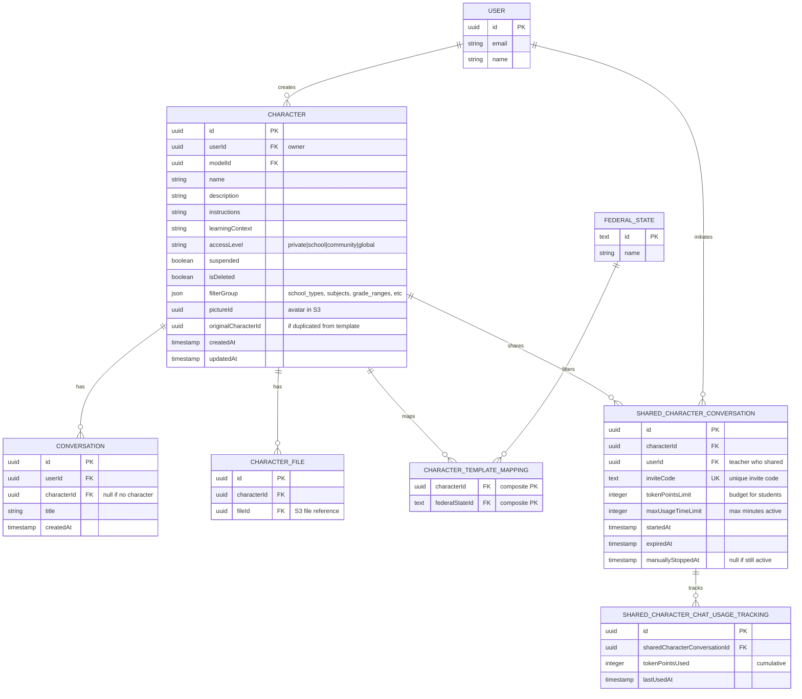
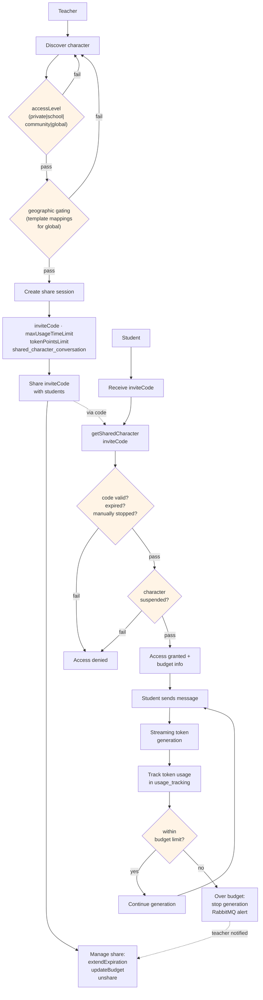
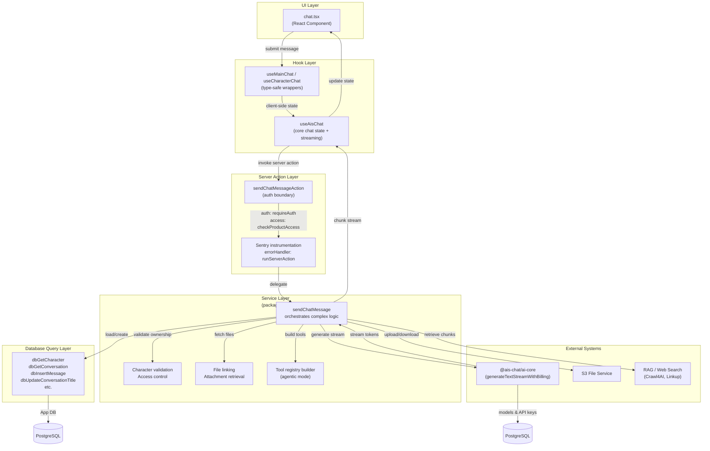
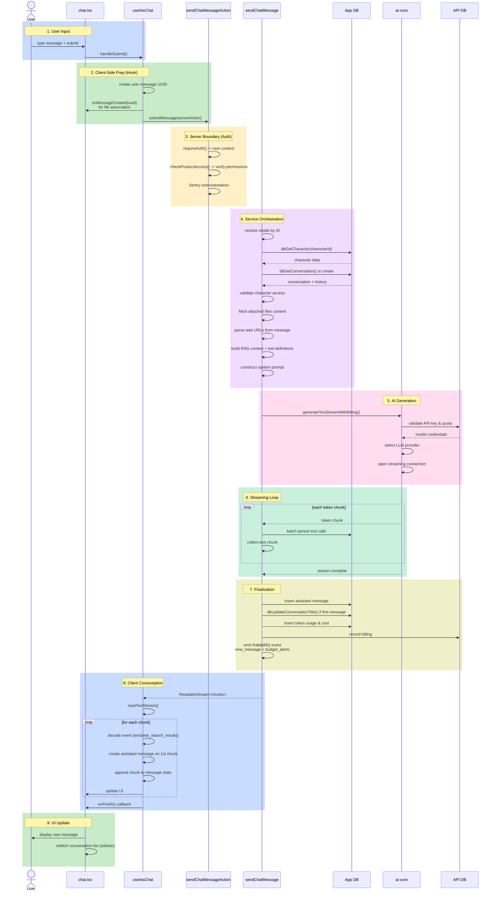

# Character-Specific Diagrams

> Status: Non-authoritative snapshot.
> Agent rule: Do not use this file as implementation context unless the user explicitly asks to update architecture docs.

This document contains architecture diagrams and notes focused on character creation, access, and sharing.

---

## 1. Character Data Model

The character system enables teachers to create reusable AI personas that can be shared with students.

**Key Insights:**

- **Access Levels** differentiate character types: `private` (owner only) -> `school` (same schools) -> `community` (all teachers) -> `global` (everyone, subject to template mapping)
- **character_template_mappings** gates global characters to specific federal states; a global character not mapped to a state will not appear in that region's listings
- **shared_character_conversation** is not a conversation row. It is a sharing session with an invite code, token budget, and expiry time. One teacher can create multiple shares for the same character
- **shared_character_chat_usage_tracking** tracks cumulative token consumption per share session, enabling budget enforcement

---

## 2. Character Access and Sharing Flow

How characters are discovered, accessed, and shared with permission gates.

**Access Control Gates (all must pass):**

1. **accessLevel** - Filters character visibility in teacher discovery (private|school|community|global)
2. **character_template_mappings** - Geographic gating for global characters (teacher's federal state)
3. **inviteCode valid** - Code must exist, not expired, and not manually stopped by teacher
4. **character not suspended** - If character is suspended, access is denied even to owner
5. **token budget** - Usage must not exceed `tokenPointsLimit` per share session

**Key Flows:**

- **Teacher creates and shares** - Discovers character -> passes access gates -> creates share session with unique inviteCode -> shares code with students
- **Student receives code** - Gets inviteCode from teacher -> looks up character -> validates code status -> checks character suspension -> receives access and budget info
- **Student uses with budget** - Sends message -> tokens stream and are tracked -> compared against limit -> if over, generation stops and teacher is notified via RabbitMQ
- **Teacher manages** - While share is active, can extend expiry, adjust budget, or manually stop share session

---

## 3. Layered Architecture: Request Flow Through Layers

How a character chat request flows vertically through the system from UI to database.

**Pattern Notes:**

- **Auth boundary**: Server actions (`'use server'`) are where auth runs; `requireAuth()` and `checkProductAccess()` block unauthorized requests before service execution
- **Streaming**: Native `ReadableStream` used; chunks passed to hook which batches and updates client state
- **Error handling**: `runServerAction` wrapper catches `BusinessError` (user-safe) and `AiGenerationError` (AI-specific), allowing Next.js errors (redirect, notFound) to propagate
- **Instrumentation**: Sentry wraps all server actions with context (userId, conversationId, etc.)

---

## 4. Chat Message Flow (Happy Path)

Detailed sequence of a user sending a message through all layers.

