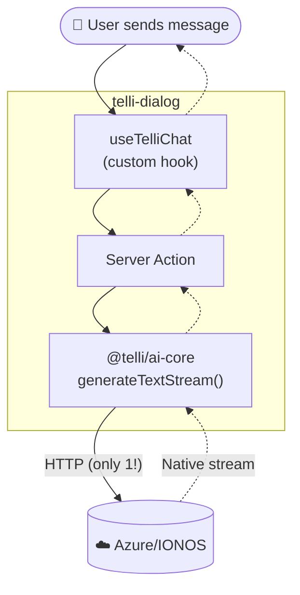

# After: Message Flow (Simplified)

**Benefits:**

- ⚡ **1 network hop** (direct to cloud)
- 📦 **No external SDK** (own code, full control)
- 🎯 **Native streams** (no format translation)
- 🗑️ **No gateway service** needed
