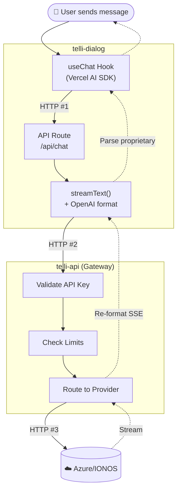

# Before: Message Flow (Simplified)

**Pain Points:**

- 🔄 **3 network hops** (Hook→Route→API→Cloud)
- 📦 **Vercel AI SDK dependency** (proprietary stream format)
- 🔀 **Format translation** at every layer
- 🏗️ **Separate gateway service** to maintain
