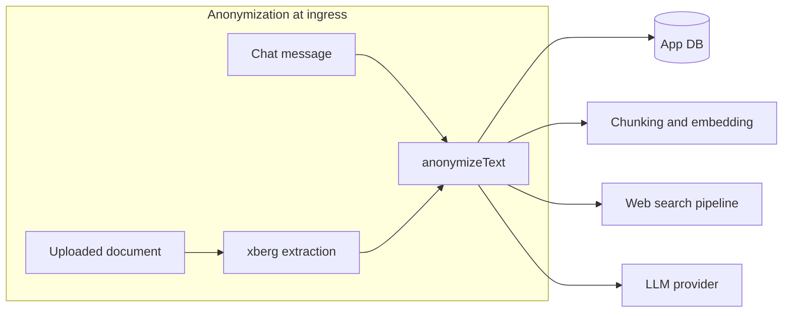

# PII Anonymization (Spec)

Status: implemented (MVP) — this document describes the design and its current limitations.

## Motivation

Teachers use AIS.chat to work with texts that can contain personal data of students and
parents (case descriptions, observation notes, report drafts, parent communication).
Even though AIS.chat is operated under strict data-protection agreements, the strongest
protection is to not send personal data to external LLM providers at all.

The idea follows the tool "AnonyMeister"
(<https://lernsachen.blog/2026/07/19/anonymeister-lokale-anonymisierung-sensibler-daten/>),
which anonymizes sensitive texts locally with Microsoft Presidio plus an optional local
LLM check before they are handed to any AI service. AnonyMeister is a single-user desktop
application; AIS.chat is a centrally hosted multi-tenant web application, so the concept
is adapted: personal data is removed **at ingress into the platform's AI pipelines**,
inside the operator's own infrastructure, before any content reaches an LLM provider,
embedding service, or web-search pipeline.

## Goals

- Remove or mask personal data (names, e-mail addresses, phone numbers, IBANs, locations)
  from chat messages and uploaded documents before they are processed by AI services.
- Opt-in per federal state via the existing feature-toggle mechanism.
- Work out of the box without extra infrastructure (built-in pattern recognizers) and
  become substantially better when a Presidio analyzer service is deployed next to the app.

## Non-Goals (for the MVP)

- OCR-based redaction of images.
- Anonymization of tool outputs produced inside the agentic loop (e.g. full-file
  retrieval, web-page fetches) — documents are covered at upload time instead.
- A UI that previews/edits detected entities before sending (AnonyMeister offers this;
  a chat UI equivalent is a possible follow-up).
- Reversible pseudonymization with persistent mapping tables.

## Design

### Where anonymization happens (ingress, not egress)

Anonymization runs **once, when content enters the platform**, not at the last moment
before the provider call:

1. **Chat messages** — in `sendChatMessage`
   (`apps/chat-bot/src/app/api/chat/chat-service.ts`), immediately after the user
   message is extracted and **before** it is persisted to the database.
2. **Uploaded documents** — in `uploadDocumentFile`
   (`apps/chat-bot/src/app/api/file-operations/file-upload-service.ts`), immediately
   after text extraction (xberg) and **before** chunking/embedding and DB persistence.

Rationale: everything downstream of these two points sends content to external services
(LLM provider, embedding API, title generation, web-search query generation). Anonymizing
at ingress covers all of these paths with two hooks, and the database itself never stores
the personal data (data minimization). The trade-off is that users see the redacted
version of their own message in the chat history after a reload — which doubles as
transparency about what was removed. The original uploaded file in object storage is
kept unchanged; only the extracted text used for AI processing is anonymized.



### Detection layers

`packages/shared/src/anonymization/` implements two detection layers whose results are
merged:

1. **Built-in recognizers** (`recognizers.ts`) — regex-based, always active:
   - `EMAIL_ADDRESS`
   - `PHONE_NUMBER` (German formats: `+49`, `0049`, national `0…` prefixes)
   - `IBAN_CODE` (validated with the MOD-97 checksum to avoid false positives)

   Pattern matching cannot detect person names; without the second layer, names pass
   through unchanged. This limitation is deliberate and documented for operators.

2. **Presidio analyzer** (`presidio.ts`) — optional, NER-based:
   - Activated by setting `ANONYMIZATION_SERVICE_URL` to a running
     [presidio-analyzer](https://microsoft.github.io/presidio/) instance.
   - Detects `PERSON`, `LOCATION` and further entity types via NLP.
   - **Fail-closed**: if the service is configured but unreachable or returns an error,
     the request fails. Silently skipping NER would break the promise the toggle makes.

Only an allowlist of entity types is replaced (`PERSON`, `EMAIL_ADDRESS`,
`PHONE_NUMBER`, `IBAN_CODE`, `LOCATION`); overly aggressive types like `DATE_TIME` are
excluded by default because dates are often pedagogically relevant.

### Replacement modes

`anonymize.ts` supports two modes (following AnonyMeister's two modes):

- **`placeholder`** (default, wired into the app): entities are replaced with generic
  German placeholders — `[PERSON]`, `[ORT]`, `[E-MAIL]`, `[TELEFONNUMMER]`, `[IBAN]`.
- **`pseudonym`**: `PERSON` entities are replaced with a deterministic pseudonym picked
  from a fixed name pool via a hash of the normalized original. The same input name maps
  to the same pseudonym across messages without any stored mapping, which keeps longer
  case descriptions readable. Non-person entities always use placeholders. Collisions
  (two different names mapping to the same pseudonym) are possible and accepted.

Overlapping detections are resolved by score, then by span length.

### Configuration

- **Feature toggle**: `isAnonymizationEnabled` on
  `federal_state.feature_toggles` (JSON column — no DB migration required), editable in
  the admin app per federal state. Default: off.
- **Environment (chat-bot)**:
  - `ANONYMIZATION_SERVICE_URL` — optional URL of a presidio-analyzer instance.
  - `ANONYMIZATION_LANGUAGE` — language passed to Presidio, default `de`.

### Running Presidio locally (German configuration)

A German-configured presidio-analyzer lives in `devops/docker/presidio/`: the
Dockerfile adds the `de_core_news_lg` spaCy model on top of the stock image (which is
English-only) and wires in `nlp-conf.yaml` / `analyzer-conf.yaml` so requests with
`language: de` work. It is part of the local docker compose behind an opt-in profile:

```sh
docker compose -f devops/docker/docker-compose.local.yml --profile anonymization up -d
ANONYMIZATION_SERVICE_URL=http://localhost:5002 pnpm dev:chat-bot
```

The CI workflow `.github/workflows/presidio.yml` builds this image and smoke-tests
that German NER detects `PERSON` and `LOCATION` whenever the Presidio configuration
changes.

## Follow-ups

- Hook the same ingress anonymization into the shared-chat / character / learning-scenario
  chat services (anonymous student flows).
- Anonymize tool outputs in the agentic loop (web fetches, full-file retrieval).
- Admin-selectable replacement mode (placeholder vs. pseudonym) per federal state.
- UI hint in the chat when a message was anonymized.
- Optional LLM-based second-pass check (AnonyMeister's "Tiefenprüfung") using the
  federal state's configured auxiliary model instead of a local Ollama instance.
- Deploy the German-configured presidio-analyzer image (`devops/docker/presidio/`)
  alongside the app in production and document it in the operations guide.
